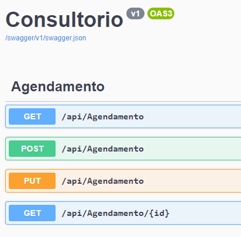
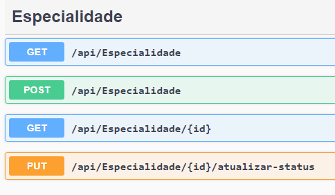
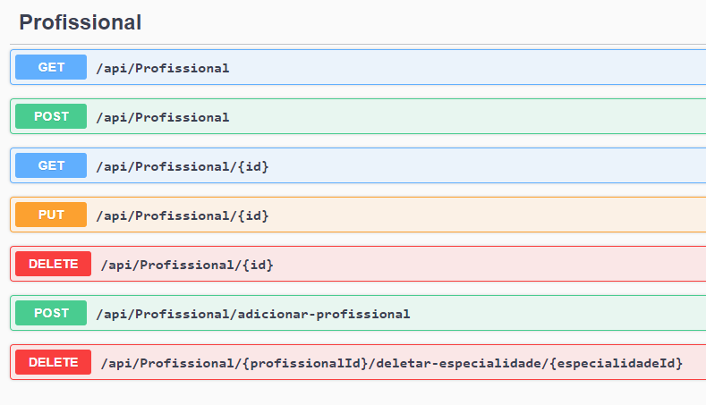

# API em ASP.NET 

<h3>API feito em ASP.NET com C#, para agendamentos e controle de um consultório fictício, com controle de especialidades, profissionais e pacientes, assim como suas consultas, podendo filtrar elas pelas datas (data de início e fim) do agendamento e uma especialidade específica. </h3>

## imgs das rotas
<h2>Agendamento</h2>

  

<h2>Paciente</h2>

<h2>Especialidade</h2>

<h2>Profissional</h2>

 